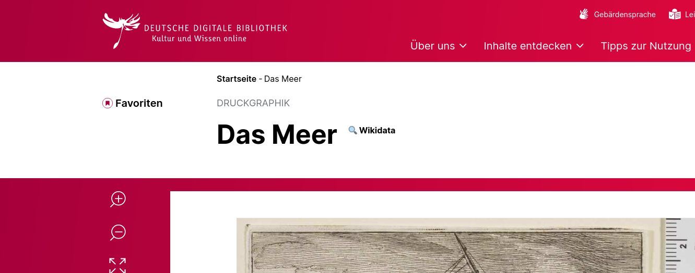

# Wikidata-Tools für DDB 

Dies ein kleines Firefox-Addon, das auf einer Objektseite der [Deutschen Digitalen Bibliothek (DDB)](https://www.deutsche-digitale-bibliothek.de), d.h. auf Seiten mit URL `https://www.deutsche-digitale-bibliothek.de/item/<DDBID>`, anzeigt, ob das Objekt über ein Wikidata-Item verfügt.

Ansicht bei vorhandeme Wikidata-Item (Klick auf Q-ID führt zum Wikidata-Item):

Ansicht ohne Wikidta-Item (Klick auf die Lupe führt auf die Such-Seite von Wikidata)

Ziel des Tools ist es, bei Nutzung der DDB Wikidata etwas präsenter zu machen und damit nach und nach immer mehr Kulturerbeobjekte auch nach Wikidata zu bringen.

## Installation in Firefox

1. Download der [`*.xpi`-Datei](https://github.com/alexander-winkler/WDtools4DDB/raw/refs/heads/main/xpi/923ae8c53b424b5abb98-0.1.xpi)
2. In die Adresszeile von Firefox `about:addons` eingeben.
3. Rechts oben auf das Zahnrad-Symbol klicken und *Add-on aus Datei installieren ...* wählen.
4. Die heruntergeladene `*.xpi`-Datei öffnen.
5. Die erforderlichen genehmigungen erteilen und bestätigen.
